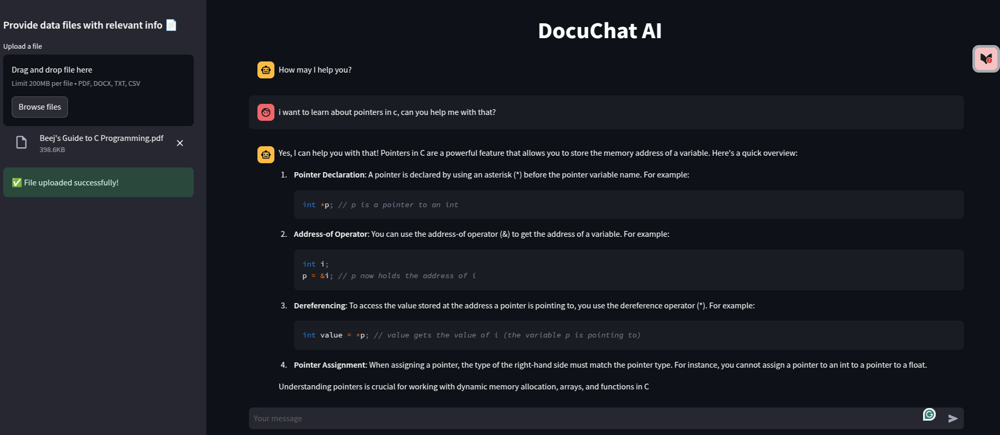

# 🚀 **DocuChat AI - Smart Document Chatbot**
**DocuChat AI** is the **ultimate AI-powered assistant** that lets you **chat with your documents**! 📄✨  
It’s designed for **students, researchers, and professionals** who need **instant insights from PDFs, DOCX, TXT, and CSV files.**  

### ✅ **What Makes DocuChat AI Special?**
✔ **Multi-Format Uploads**: Supports PDFs, Word Docs, TXTs & CSVs  
✔ **Smart AI Search**: Uses **DeepSeek R1 & GPT-4o** for better answers  
✔ **Web Integration**: If the doc lacks info, AI **fetches real-time data** from Google  
✔ **FAISS Vector Search**: Efficient **memory retrieval** for **fast answers**  
✔ **Advanced Analytics**: 🚀- Tracks **peak usage days & AI sources (RAG, GPT, Web)**  

🔗 **Try It Now →** [**DocuChat AI**](https://docuchats-ai.streamlit.app/)  

  

---

## 📊 **📈 Why Analytics Matter?**
We now **track every user query**, storing **response sources** (RAG, GPT-4o, or Web).  
This provides **businesses & researchers** with key insights like:  
✅ **Peak Usage Days** – Know when users are most active 📊  
✅ **Most Used AI Model** – RAG vs. GPT vs. Web 🔍  
✅ **User Engagement Trends** – Optimize performance 💡  

**Why This Matters?**  
Businesses can now **see where users get stuck**, helping them improve **knowledge bases, FAQs, and support docs**. 🚀  

---

## 🔹 **Project Structure & Features**
This guide provides a **detailed breakdown** of the files in the repository, explaining their purpose and how they contribute to the app’s functionality.

---

### **📂 Project Files & What They Do**
| File | Purpose |
|-----------|------------|
| `.env` | Stores API keys (GPT, DeepSeek, Web Search) 🔑 |
| `.gitignore` | Ensures sensitive files (API keys, cache) aren’t uploaded 🚫 |
| `main.py` | **Core AI Logic** – Handles uploads, AI processing, & responses 🤖 |
| `app.sh` | **Auto Setup** – Launches the app in one click 🚀 |
| `requirements.txt` | **Dependency List** – Install all required packages 📦 |
| `setup.sh` | Automates virtual environment & installation 🛠 |

---

## 🛠️ **Tech Stack**
✅ **LangChain** – Manages **AI-driven document retrieval**  
✅ **FAISS** – Speeds up document searches  
✅ **GPT-4o & DeepSeek R1** – AI-powered text generation  
✅ **Streamlit** – User-friendly UI  
✅ **SerpAPI / Bing API** – Web search fallback  

---

## 💻 **Installation Guide (Run Locally)**
### **1️⃣ Clone the repository**
```bash
git clone git@github.com:cousintiz/Marta-GPT-v0.0.1.git
cd Marta-GPT-v0.0.1
```

### **2️⃣ Create a virtual environment**
```bash
python3 -m venv venv
```

### **3️⃣ Activate the virtual environment**
#### **MacOS/Linux:**
```bash
source venv/bin/activate
```
#### **Windows (Command Prompt):**
```cmd
venv\Scripts\activate
```
#### **Windows (PowerShell):**
```powershell
venv\Scripts\Activate.ps1
```

### **4️⃣ Install dependencies**
```bash
pip install -r requirements.txt
```

### **5️⃣ Run the App Locally**
```bash
streamlit run main.py
```

### **6️⃣ Open the app in your browser**
Once the app starts, it will automatically open in your default browser. If not, go to:
```
http://localhost:8501
```

### **7️⃣ Get an OpenAI API Key**
- Create an OpenAI account if you don’t have one.
- Get your API key [here](https://platform.openai.com/api-keys)
- Enter the API key in the app when prompted.

---

## 🌐 **Cloud Deployment (No Installation Required)**
🔗 **Try it live:** [**DocuChat AI**](https://docuchats-ai.streamlit.app/)  

✅ **No setup needed**  
✅ **Upload & chat instantly**  
✅ **Works on any device**  

---

## 🚀 **How It Works**
1️⃣ **User Uploads a Document**  
   - Supported formats: **PDF, DOCX, TXT, CSV**  
   - File is **temporarily stored** for processing  

2️⃣ **AI Reads & Understands**  
   - Uses **LangChain + FAISS** for fast document retrieval  
   - Creates a **vector store** for better memory  

3️⃣ **AI Answers User Questions**  
   - First, **retrieves relevant info** from the doc (RAG)  
   - If no answer is found, **GPT-4o generates a response**  
   - If GPT also doesn’t know, it **searches Google/Bing**  

4️⃣ **Insights Are Logged **  
   - ✅ **Timestamps are saved**  
   - ✅ **AI Source (RAG, GPT, Web) is recorded**  
   - ✅ **Data is analyzed to track trends**  

5️⃣ **Secure & Clean**  
   - AI **deletes uploaded files after each session**  
   - User queries are **anonymized** for privacy  

---

## 🏆 **Why Use DocuChat AI?**
✔ **Saves Hours of Manual Searching**  
✔ **Instant AI-Powered Insights**  
✔ **Web Search When Docs Lack Data**  
✔ **Enterprise-Grade Security**  
✔ **Now With AI Usage Analytics!**  

🔗 **Start Chatting Now** → [**DocuChat AI**](https://docuchats-ai.streamlit.app/)  

---

## 🛠️ **Want to Contribute?**
We welcome **open-source contributions!**  
### **Ways to Help:**
✅ Improve **document parsing**  
✅ Add **multi-language support**  
✅ Optimize **search & retrieval**  
✅ Fix **bugs & issues**  
✅ Suggest **new features** 🚀  

---

## 📜 **License**
This project is **MIT Licensed**, meaning it’s **free to use, modify, and share**.  

---

### **🔥 Ready to Try?**
1️⃣ Clone the repo  
2️⃣ Install dependencies  
3️⃣ Set up your API keys  
4️⃣ Start **chatting with your documents!** 🚀  

---

📌 **Need Help?** Contact us on **GitHub Discussions**! 😊